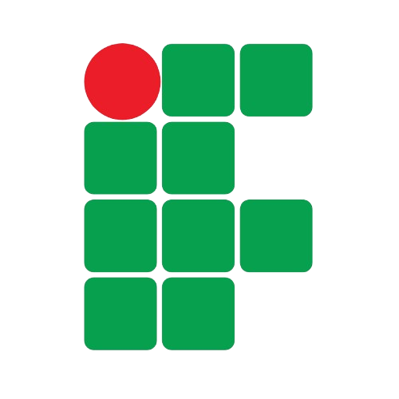

# Olá! Eu sou o Davis Demosthenes 👋

  

---

###  Sobre Mim

Sou **Davis Demosthenes Wilstherman Rodrigues Queiroz**, um desenvolvedor Full Stack focado em criar soluções escaláveis. Tenho facilidade em comunicação e vasta experiência em projetos colaborativos.

-  **Idade:** 20 anos
-  **Localização:** Rio Grande do Norte, Brasil
-  Aberto a colaborações em projetos inovadores.
-  **Visitas:** 

---

###  Formação Acadêmica

| Instituição | Curso | Status |
| :--- | :--- | :--- |
|  | **Técnico em Informática** (IFRN) | Concluído |
| | **Bacharelado em Tecnologia da Informação** (UFERSA) | Em curso |

> **Destaque (IFRN):** Lógica de Programação, Algoritmos e Estrutura de Dados. Desenvolvimento Web Full Stack (HTML, CSS, JS, Python). Banco de Dados Relacionais e SQL. Redes de Computadores e Sistemas Operacionais.

---

###  Tech Stack
Aqui estão as ferramentas e tecnologias que utilizo para dar vida às ideias:

  

| Categoria | Tecnologias |
| :--- | :--- |
| **Linguagens** |     |
| **Web / Backend** |   |
| **Infra / Cloud** |    |

---

###  Estatísticas

  
  

  

---

###  Contato

  
  

  

