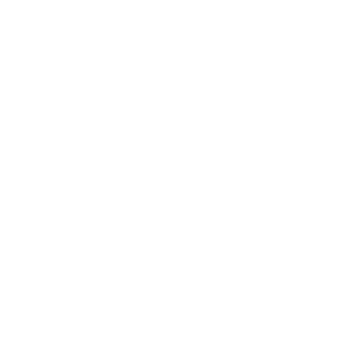

  

  

---

###  Sobre Mim

Sou **Davis Demosthenes Wilstherman Rodrigues Queiroz**, um desenvolvedor Full Stack focado em criar soluções escaláveis. Tenho facilidade em comunicação e vasta experiência em projetos colaborativos.

-  **Idade:** 20anos
-  **Localização:** Rio Grande do Norte, Brasil
-  Aberto a colaborações em projetos inovadores.
-  **Visitas:** 

---

###  Formação Acadêmica

| Instituição | Curso | Status |
| :--- | :--- | :--- |
|  | **Técnico em Informática** (IFRN) | Concluído |
| | **Bacharelado em Tecnologia da Informação** (UFERSA) | Em curso |

> **Destaque (IFRN):** Lógica de Programação, Algoritmos e Estrutura de Dados; Desenvolvimento Web Full Stack (HTML, CSS, JS, Python); Redes de Computadores e Sistemas Operacionais.

> **Destaque (UFERSA):** Engenharia de Software e Metodologias Ágeis; Arquitetura de Computadores e Sistemas Distribuídos; Governança de TI e Gestão de Projetos Tecnológicos.

---

###  Tech Stack

Aqui estão as ferramentas e tecnologias que utilizo para dar vida às ideias:

  

| Categoria | Tecnologias |
| :--- | :--- |
| **Linguagens** |     |
| **Infra / Cloud** |    |

---

###  Estatísticas de Desempenho

  
  

  

---

###  Networking & Documentação

  
  
  
  

  

